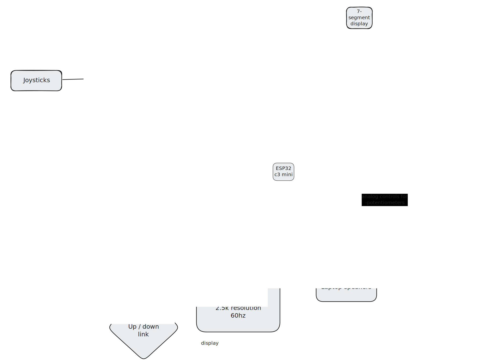
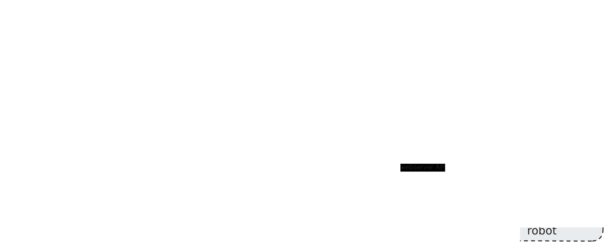

# Ground-Control-Station

## Background
I've always had a fascination with radio communication that is not wifi or bluetooth as I did not get a chance to explore it in my course. For my final year project I am building a custom ground control station (similar to: https://d3.xlrs.eu/gcsd5/) to control a robot dog.

This station would be equipped with an analog video reciever that would convert video signal from the robot into HDMI. I would then use HDMI to CSI device which feeds into the camera interface of the raspberry pi.
I would also like the raspberry pi to control a long-range RC drone controller.

## Case Statement
The majority of robotics / drone platforms come with a radio controller which is almost identical for each brand. These radio controllers are limited in their feature set, however they allow for expansion of features with modules like the Pixihawk combined with the use of software packages like QGroundControl or ArduPilot. 

I believe that the process of configuring the hardware and software control is quite cumbersome. The look and feel of robotics contol software packages is very much outdated and unintuitive - miles behind compared modern web application UI / UX.  

The aim of the ground control station briefcase is to simplicy the configuration step of robotics control while offering the end-user a more complete set of features out-of-the-box.

The platform offers a much more sleek and intuitive user interface with a focus on live video transmission  - a feature that the traditional robotics control software packages are missing.
It also features an interface for the BBC Microbit to be plugged in and send control code to the robot / drone over a much longer distance compared to the defualt radio transmission capabilities of the BBC Microbit.

## Architecture
The following diagrams outline the hardware and software connections of the ground control station:
### Hardware

### Software

## Proposed UI
The following is a mockup of the proposed UI for a USV (unmanned surface vessel) application:

Initial Screen:

Mission Screen:

Technical Screen:
